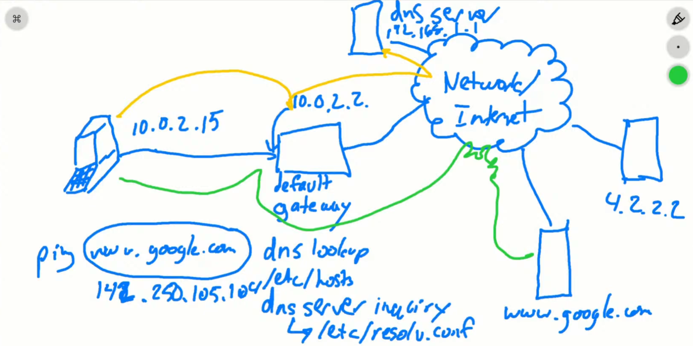

# Networking Troubleshooting

## [Troubleshooting Linux Networking | Into the Terminal 114
](https://www.youtube.com/watch?v=dHa2Bja85U0&t=843s)

### Networking Tools

``` bash
shad@linux:~/linux/notes/networking$ ping www.shad.dev
PING shadikhan.github.io (185.199.111.153) 56(84) bytes of data.
64 bytes from cdn-185-199-111-153.github.com (185.199.111.153): icmp_seq=1 ttl=53 time=1.48 ms
64 bytes from cdn-185-199-111-153.github.com (185.199.111.153): icmp_seq=2 ttl=53 time=1.44 ms
64 bytes from cdn-185-199-111-153.github.com (185.199.111.153): icmp_seq=3 ttl=53 time=1.43 ms
64 bytes from cdn-185-199-111-153.github.com (185.199.111.153): icmp_seq=4 ttl=53 time=1.52 ms
64 bytes from cdn-185-199-111-153.github.com (185.199.111.153): icmp_seq=5 ttl=53 time=1.36 ms
64 bytes from cdn-185-199-111-153.github.com (185.199.111.153): icmp_seq=6 ttl=53 time=1.44 ms
^C
--- shadikhan.github.io ping statistics ---
6 packets transmitted, 6 received, 0% packet loss, time 5007ms
rtt min/avg/max/mdev = 1.364/1.446/1.522/0.047 ms
```
- ping sends ICMP echo request packets to a host and waits for an ICMP echo reply.
- Could tell us if packets are being dropped as well as the latency of the connection.

``` bash
# -T use TCP SYN packets instead of ICMP ECHO
shad@linux:~/linux/notes/networking$ sudo traceroute -T www.shad.dev
traceroute to www.shad.dev (185.199.108.153), 30 hops max, 60 byte packets
 1  * * *
 2  * * *
 3  * * *
 4  * * *
 5  * * *
 6  * * *
 7  * * *
 8  * * *
 9  * * *
10  * * *
11  cdn-185-199-108-153.github.com (185.199.108.153)  1.618 ms  1.486 ms  1.448 ms
```

- tracepath succeeds traceroute
- tracepath sends UDP packets with incrementing TTL values to discover the path to a destination.
- `no reply`: could be turn off error messaging. 

``` bash
shad@linux:~/linux/notes/networking$ dig www.shad.dev

; <<>> DiG 9.18.39-0ubuntu0.24.04.2-Ubuntu <<>> www.shad.dev
;; global options: +cmd
;; Got answer:
;; ->>HEADER<<- opcode: QUERY, status: NOERROR, id: 30980
;; flags: qr rd ra; QUERY: 1, ANSWER: 5, AUTHORITY: 0, ADDITIONAL: 5

;; OPT PSEUDOSECTION:
; EDNS: version: 0, flags:; udp: 65494
;; QUESTION SECTION:
;www.shad.dev.                  IN      A

;; ANSWER SECTION:
www.shad.dev.           1178    IN      CNAME   shadikhan.github.io.
shadikhan.github.io.    1178    IN      A       185.199.109.153
shadikhan.github.io.    1178    IN      A       185.199.111.153
shadikhan.github.io.    1178    IN      A       185.199.108.153
shadikhan.github.io.    1178    IN      A       185.199.110.153

;; ADDITIONAL SECTION:
shadikhan.github.io.    1178    IN      AAAA    2606:50c0:8001::153
shadikhan.github.io.    1178    IN      AAAA    2606:50c0:8002::153
shadikhan.github.io.    1178    IN      AAAA    2606:50c0:8003::153
shadikhan.github.io.    1178    IN      AAAA    2606:50c0:8000::153

;; Query time: 0 msec

# This is the DNS Resolver our system queried.
;; SERVER: 127.0.0.53#53(127.0.0.53) (UDP)
;; WHEN: Sat Nov 22 17:36:08 UTC 2025
;; MSG SIZE  rcvd: 250
```

- dig is a DNS Lookup Tool, gives you the full DNS record.

``` bash
# Shows you all network interfaces and their IP addresses.
shad@linux:~/linux/notes/networking$ ip a
1: lo: <LOOPBACK,UP,LOWER_UP> mtu 65536 qdisc noqueue state UNKNOWN group default qlen 1000
    link/loopback 00:00:00:00:00:00 brd 00:00:00:00:00:00
    inet 127.0.0.1/8 scope host lo
       valid_lft forever preferred_lft forever
    inet6 ::1/128 scope host noprefixroute 
       valid_lft forever preferred_lft forever
2: eth0: <BROADCAST,MULTICAST,UP,LOWER_UP> mtu 1500 qdisc mq state UP group default qlen 1000
    link/ether 60:45:bd:ef:f3:4d brd ff:ff:ff:ff:ff:ff
    inet 10.0.0.4/24 metric 100 brd 10.0.0.255 scope global eth0
       valid_lft forever preferred_lft forever
    inet6 fe80::6245:bdff:feef:f34d/64 scope link 
       valid_lft forever preferred_lft forever
3: enP31006s1: <BROADCAST,MULTICAST,SLAVE,UP,LOWER_UP> mtu 1500 qdisc mq master eth0 state UP group default qlen 1000
    link/ether 60:45:bd:ef:f3:4d brd ff:ff:ff:ff:ff:ff
    altname enP31006p0s2
    inet6 fe80::6245:bdff:feef:f34d/64 scope link 
       valid_lft forever preferred_lft forever

shad@linux:~/linux/notes/networking$ ip r

# <name of route> <send traffic to> <interface> <how created> <source ip to use> <priority>

# Send all non-local traffic to 10.0.0.1 (your default gateway) using eth0.
default via 10.0.0.1 dev eth0 proto dhcp src 10.0.0.4 metric 100

#  This is your local subnet. Traffic to any 10.0.0.x host stays on eth0.
10.0.0.0/24 dev eth0 proto kernel scope link src 10.0.0.4 metric 100

# Direct host route for the gateway itself. Lets you reach 10.0.0.1 directly on eth0.
10.0.0.1 dev eth0 proto dhcp scope link src 10.0.0.4 metric 100

# Azure metadata/provisioning endpoint. Reached via the default gateway.
168.63.129.16 via 10.0.0.1 dev eth0 proto dhcp src 10.0.0.4 metric 100

# Azure Instance Metadata Service (IMDS). Also routed through the gateway.
169.254.169.254 via 10.0.0.1 dev eth0 proto dhcp src 10.0.0.4 metric 100 

# To see local routes:
shad@linux:~/linux/notes/images$ ip route show table local
local 10.0.0.4 dev eth0 proto kernel scope host src 10.0.0.4 
broadcast 10.0.0.255 dev eth0 proto kernel scope link src 10.0.0.4 
local 127.0.0.0/8 dev lo proto kernel scope host src 127.0.0.1 
local 127.0.0.1 dev lo proto kernel scope host src 127.0.0.1 
broadcast 127.255.255.255 dev lo proto kernel scope link src 127.0.0.1 

# To see routing rules. Note that we'll look at the local table first, then main, then default.
shad@linux:~/linux/notes/images$ ip rule
0:      from all lookup local
32766:  from all lookup main
32767:  from all lookup default

# To see which route a specific IP will take:
shad@linux:~/linux/notes/images$ ip route get 127.0.0.53
local 127.0.0.53 dev lo src 127.0.0.1 uid 1000 
    cache <local>
```

### Packet Flow



- Our private ip is 10.0.0.4
- Our default gateway is 10.0.0.1 (usually the router)

``` bash
shad@linux:~/linux/notes/images$ cat /etc/hosts
127.0.0.1 localhost

# The following lines are desirable for IPv6 capable hosts
::1 ip6-localhost ip6-loopback
fe00::0 ip6-localnet
ff00::0 ip6-mcastprefix
ff02::1 ip6-allnodes
ff02::2 ip6-allrouters
ff02::3 ip6-allhosts

shad@linux:~/linux/notes/images$ cat /etc/resolv.conf 
# This is /run/systemd/resolve/stub-resolv.conf managed by man:systemd-resolved(8).
# Do not edit.
#
# This file might be symlinked as /etc/resolv.conf. If you're looking at
# /etc/resolv.conf and seeing this text, you have followed the symlink.
#
# This is a dynamic resolv.conf file for connecting local clients to the
# internal DNS stub resolver of systemd-resolved. This file lists all
# configured search domains.
#
# Run "resolvectl status" to see details about the uplink DNS servers
# currently in use.
#
# Third party programs should typically not access this file directly, but only
# through the symlink at /etc/resolv.conf. To manage man:resolv.conf(5) in a
# different way, replace this symlink by a static file or a different symlink.
#
# See man:systemd-resolved.service(8) for details about the supported modes of
# operation for /etc/resolv.conf.

nameserver 127.0.0.53
options edns0 trust-ad
search ejerx3zmwrpu5aaglblppkwcvh.bx.internal.cloudapp.net
```

- `/etc/hosts` is first checked for hostname to IP mappings before querying DNS servers.
- `/etc/resolv.conf` lists the DNS servers our system will query to resolve domain names.
- First, a DNS lookup happens to resolve the domain name. Since the DNS server is outside my subnet (see below insights), that DNS query goes through the default gateway. Once the IP address is returned, my system checks whether that destination is in the local network. Because it isn’t, the traffic is sent to the default gateway, which then routes it out to the internet.

### Troubleshooting DNS

- `ping www.google.com` doesn't work! Let's simplify, when we use hostname as an argument, we introduce complication of DNS lookup.
- `ping <Google's IP address>` is working fine. `tracepath -n <Google's IP address>` also works fine. Note that `-n` flag prevents DNS lookups.
- So the problem is DNS related.
- `ping <nameserver IP> (from /etc/resolv.conf)` does not work. So it looks like the DNS problems is due to not being able to reach the DNS server.
- Before we check if there is something wrong with the DNS server itself, let's check our local configuration first.


``` bash

# Interesting, our DNS server is set to 168.63.129.16, not 127.0.0.53
# This might be a thing with my Azure VM Setup.
shad@linux:~/linux/notes/images$ resolvectl status
Global
         Protocols: -LLMNR -mDNS -DNSOverTLS DNSSEC=no/unsupported
  resolv.conf mode: stub

Link 2 (eth0)
    Current Scopes: DNS
         Protocols: +DefaultRoute -LLMNR -mDNS -DNSOverTLS DNSSEC=no/unsupported
Current DNS Server: 168.63.129.16
       DNS Servers: 168.63.129.16
        DNS Domain: ejerx3zmwrpu5aaglblppkwcvh.bx.internal.cloudapp.net

Link 3 (enP31006s1)
    Current Scopes: none
         Protocols: -DefaultRoute -LLMNR -mDNS -DNSOverTLS DNSSEC=no/unsupported
shad@linux:~/linux/notes/images$ 
```
- In this video, `nmcli connection show enp0s3` showed that `IP4.DNS` was different from the one in `/etc/resolv.conf`. Changing it back to matching `IP4.DNS` fixed the issue.
- Another issue that can happen if the wrong nameserver is higher in the `/etc/resolv.conf` list, which could lead to slower lookups.

### Troubleshooting Routes

- This time, neither `ping www.google.com` nor `ping <Google's IP address>` is working.
- Check if ip addresses are configured

``` bash
shad@linux:~/linux/notes/images$ ip a
1: lo: <LOOPBACK,UP,LOWER_UP> mtu 65536 qdisc noqueue state UNKNOWN group default qlen 1000
    link/loopback 00:00:00:00:00:00 brd 00:00:00:00:00:00
    inet 127.0.0.1/8 scope host lo
       valid_lft forever preferred_lft forever
    inet6 ::1/128 scope host noprefixroute 
       valid_lft forever preferred_lft forever
2: eth0: <BROADCAST,MULTICAST,UP,LOWER_UP> mtu 1500 qdisc mq state UP group default qlen 1000
    link/ether 60:45:bd:ef:f3:4d brd ff:ff:ff:ff:ff:ff
    inet 10.0.0.4/24 metric 100 brd 10.0.0.255 scope global eth0
       valid_lft forever preferred_lft forever
    inet6 fe80::6245:bdff:feef:f34d/64 scope link 
       valid_lft forever preferred_lft forever
3: enP31006s1: <BROADCAST,MULTICAST,SLAVE,UP,LOWER_UP> mtu 1500 qdisc mq master eth0 state UP group default qlen 1000
    link/ether 60:45:bd:ef:f3:4d brd ff:ff:ff:ff:ff:ff
    altname enP31006p0s2
    inet6 fe80::6245:bdff:feef:f34d/64 scope link 
       valid_lft forever preferred_lft forever
```

- We have two IP addresses on eth0, 10.0.0.4/24 and fe80::6245:bdff:feef:f34d/64.
- Let's try to connect to a machine in our subnet. `ping 10.0.0.4` and that works.
- `ping <dns server ip>` does not work.
- So, traffic can flow to local subnet, but not outside of it. Hmm...
- Recall that:
    - If i'm sending stuff to local subnet, put on the interface and sent.
    - If i'm sending stuff outside local subnet, send to a special machine called the default gateway, and the gateway is connected to other networks.
- Let's check our routes `ip r`. It shows that we are routing to a gateway with an ip of `192.168.10.1`, which does not exist! Let's delete that route `route del default gw 192.168.10.1`. Now we see that things are working as we expect.
- So the problem was we had a bogus/non-functioning gateway in my routing table, and it was listed first, which meant that was the default route my machine would pass traffic to, which is why as soon as it got there, the traffic just stopped.
- We also observed this from `ping`, which showed `From <bogus gateway ip> icmp_seq=1 Destination Host Unreachable`.
- Recommend we have only 1 default gateway in the routing table.

### Troubleshooting ping

- `ping`: ICMP protocol.
- `tracepath`: UDP protocol.
- `traceroute`: TCP or UDP protocol. `-T` flag uses TCP SYN packets.
- Administrators can set things on their machines to set things differently.

``` bash
# Kernel setting to ignore all ICMP echo requests (pings). Currently allowed (0).
shad@linux:~/linux/notes/images$ cat /proc/sys/net/ipv4/icmp_echo_ignore_all
0
```

- It's important to know which protocol a tool uses. For example, if `ping` is not working, but `tracepath` is, then it could be that ICMP packets are being blocked somewhere along the route.
- Similarly, if `traceroute -T` works, but `tracepath` does not, then it could be that UDP packets are being blocked somewhere.
