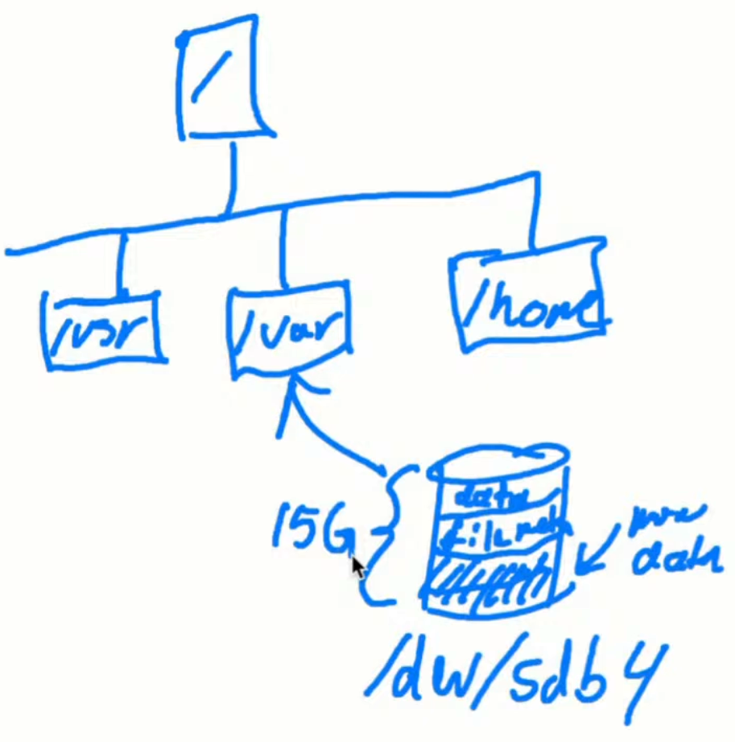
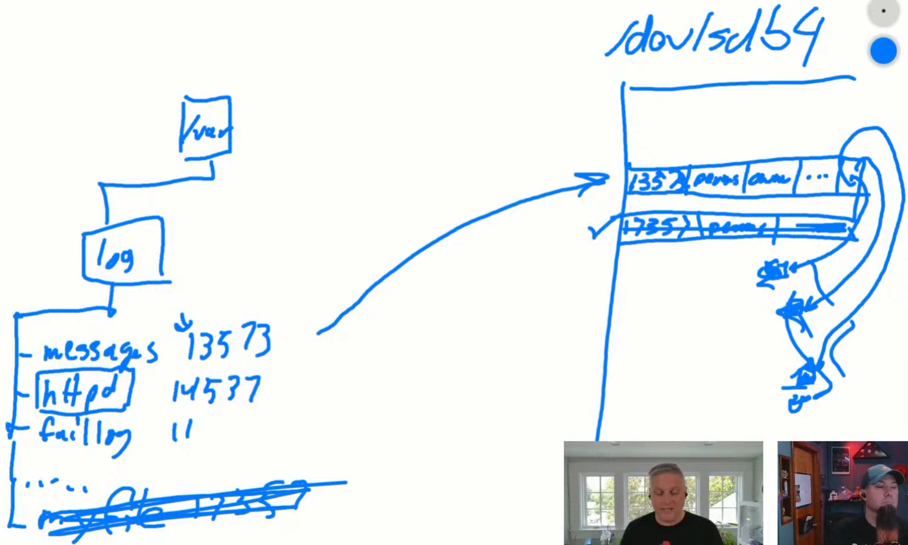

# Filesystem Troubleshooting

## [Troubleshoot Linux Filesystem & Mount Problems | Into the Terminal 111
](https://www.youtube.com/live/-qKV2o9R0XI?si=GHTvxGkBuDrX5o-E)

### File System Tools

``` bash
# What disks and partitions are available on the system?
# "List Block Devices"
shad@linux:~/linux/notes/networking$ lsblk
NAME    MAJ:MIN RM  SIZE RO TYPE MOUNTPOINTS
sda       8:0    0   30G  0 disk 
├─sda1    8:1    0   29G  0 part /
├─sda14   8:14   0    4M  0 part 
├─sda15   8:15   0  106M  0 part /boot/efi
└─sda16 259:0    0  913M  0 part /boot
sdb       8:16   0   16G  0 disk 
└─sdb1    8:17   0   16G  0 part /mnt

# Show detailed information about available block devices
shad@linux:~/linux/notes/networking$ blkid
/dev/sdb1: LABEL="Temporary Storage" BLOCK_SIZE="512" UUID="9490151C90150680" TYPE="ntfs" PARTUUID="76ec78d5-01"
/dev/sda16: LABEL="BOOT" UUID="4e0b0f7d-f018-493d-b384-d56a4d4661bd" BLOCK_SIZE="4096" TYPE="ext4" PARTUUID="bc888243-c7df-4555-b820-0fa1621cf3e0"
/dev/sda15: LABEL_FATBOOT="UEFI" LABEL="UEFI" UUID="B0C0-7511" BLOCK_SIZE="512" TYPE="vfat" PARTUUID="d403963f-6b02-4be2-96ef-428181705f25"
/dev/sda1: LABEL="cloudimg-rootfs" UUID="fad0ebd7-fc6c-42fe-a34d-4e8d2f07946f" BLOCK_SIZE="4096" TYPE="ext4" PARTUUID="625cad27-7b63-4e5e-8bbd-6efc33b38415"

# Shows you all mounted filesystems and their mount options
shad@linux:~/linux/notes/networking$ mount
/dev/sda1 on / type ext4 (rw,relatime,discard,errors=remount-ro,commit=30)
devtmpfs on /dev type devtmpfs (rw,nosuid,noexec,relatime,size=4036848k,nr_inodes=1009212,mode=755,inode64)
proc on /proc type proc (rw,nosuid,nodev,noexec,relatime)
sysfs on /sys type sysfs (rw,nosuid,nodev,noexec,relatime)
securityfs on /sys/kernel/security type securityfs (rw,nosuid,nodev,noexec,relatime)
tmpfs on /dev/shm type tmpfs (rw,nosuid,nodev,inode64)
devpts on /dev/pts type devpts (rw,nosuid,noexec,relatime,gid=5,mode=620,ptmxmode=000)
tmpfs on /run type tmpfs (rw,nosuid,nodev,size=1616532k,nr_inodes=819200,mode=755,inode64)
tmpfs on /run/lock type tmpfs (rw,nosuid,nodev,noexec,relatime,size=5120k,inode64)
cgroup2 on /sys/fs/cgroup type cgroup2 (rw,nosuid,nodev,noexec,relatime,nsdelegate,memory_recursiveprot)
pstore on /sys/fs/pstore type pstore (rw,nosuid,nodev,noexec,relatime)
efivarfs on /sys/firmware/efi/efivars type efivarfs (rw,nosuid,nodev,noexec,relatime)
bpf on /sys/fs/bpf type bpf (rw,nosuid,nodev,noexec,relatime,mode=700)
systemd-1 on /proc/sys/fs/binfmt_misc type autofs (rw,relatime,fd=32,pgrp=1,timeout=0,minproto=5,maxproto=5,direct,pipe_ino=1639)
hugetlbfs on /dev/hugepages type hugetlbfs (rw,nosuid,nodev,relatime,pagesize=2M)
mqueue on /dev/mqueue type mqueue (rw,nosuid,nodev,noexec,relatime)
debugfs on /sys/kernel/debug type debugfs (rw,nosuid,nodev,noexec,relatime)
tracefs on /sys/kernel/tracing type tracefs (rw,nosuid,nodev,noexec,relatime)
fusectl on /sys/fs/fuse/connections type fusectl (rw,nosuid,nodev,noexec,relatime)
configfs on /sys/kernel/config type configfs (rw,nosuid,nodev,noexec,relatime)
/dev/sda16 on /boot type ext4 (rw,relatime,discard)
/dev/sda15 on /boot/efi type vfat (rw,relatime,fmask=0077,dmask=0077,codepage=437,iocharset=iso8859-1,shortname=mixed,errors=remount-ro)
binfmt_misc on /proc/sys/fs/binfmt_misc type binfmt_misc (rw,nosuid,nodev,noexec,relatime)
/dev/sdb1 on /mnt type ext4 (rw,relatime,x-systemd.after=cloud-init.service,_netdev)
tmpfs on /run/user/1000 type tmpfs (rw,nosuid,nodev,relatime,size=808264k,nr_inodes=202066,mode=700,uid=1000,gid=1000,inode64)

# Human readable output to space available
shad@linux:~/linux/notes/networking$ df -h
Filesystem      Size  Used Avail Use% Mounted on
/dev/root        29G  3.3G   25G  12% /
tmpfs           3.9G     0  3.9G   0% /dev/shm
tmpfs           1.6G 1016K  1.6G   1% /run
tmpfs           5.0M     0  5.0M   0% /run/lock
efivarfs        128K   37K   87K  30% /sys/firmware/efi/efivars
/dev/sda16      881M  110M  710M  14% /boot
/dev/sda15      105M  6.2M   99M   6% /boot/efi
/dev/sdb1        16G   28K   15G   1% /mnt
tmpfs           790M   12K  790M   1% /run/user/1000

# Human readable output to inode usage
shad@linux:~/linux/notes/networking$ df -hi
Filesystem     Inodes IUsed IFree IUse% Mounted on
/dev/root        3.7M  116K  3.6M    4% /
tmpfs            987K     1  987K    1% /dev/shm
tmpfs            800K   788  800K    1% /run
tmpfs            987K     3  987K    1% /run/lock
efivarfs            0     0     0     - /sys/firmware/efi/efivars
/dev/sda16        58K   604   57K    2% /boot
/dev/sda15          0     0     0     - /boot/efi
/dev/sdb1        1.0M    12  1.0M    1% /mnt
tmpfs            198K    36  198K    1% /run/user/1000

# Human readable output to directory size
shad@linux:~$ du -hs /home/shad
754M    /home/shad

# Human readable output to directory size, max depth 1
shad@linux:~$ du -h --max-depth 1 /home/shad
12K     /home/shad/.local
24K     /home/shad/folder1
677M    /home/shad/.vscode-server
16K     /home/shad/.cache
24K     /home/shad/.ssh
16K     /home/shad/root
228K    /home/shad/.dotnet
77M     /home/shad/linux
16K     /home/shad/.config
754M    /home/shad

# List open file handles
shad@linux:~$ sudo lsof | grep /var/log/auth.log
rsyslogd    882                          syslog    9w      REG                8,1    252846      34523 /var/log/auth.log
rsyslogd    882   933 in:imuxso          syslog    9w      REG                8,1    252846      34523 /var/log/auth.log
rsyslogd    882   934 in:imklog          syslog    9w      REG                8,1    252846      34523 /var/log/auth.log
rsyslogd    882   935 rs:main            syslog    9w      REG                8,1    252846      34523 /var/log/auth.log
```

### What is a filesystem?



- This directory structure is built out of component devices.
- So `/var/` could be on a disk partition `/dev/sdb4`. Inside here, we've applied a file system format, like ext4, so that we can store files and directories.
- Within `/dev/sdb4`, there's data, file metadata, etc.
- Note that the partition `/dev/sdb4` has finite size (ex. 15 GB). So when we put things in `/var/`, we're using that size.
- Within the filesystem format in `/dev/sdb4`, there are data blocks (file contents) and inodes (file pointer, tracking metadata: data block locations, permissions, timestamps, etc).

### Accessing my files

